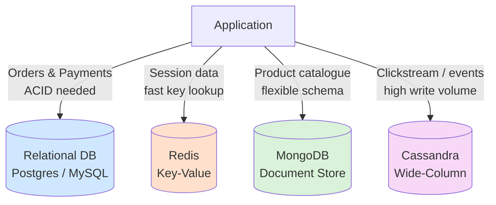
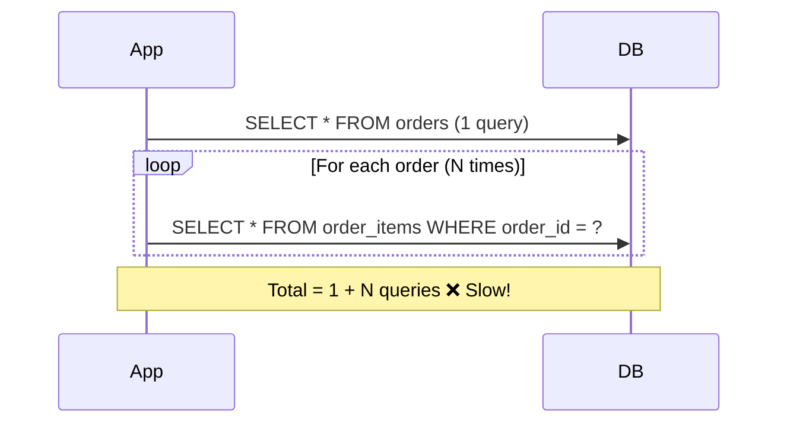
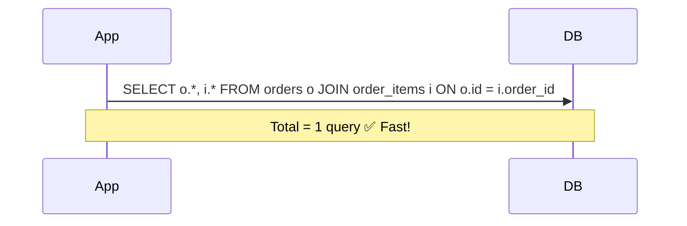
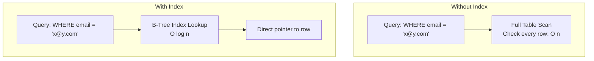
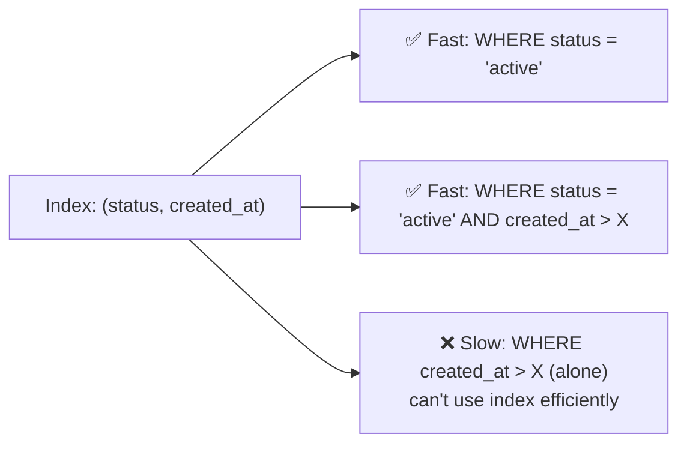

# Database System Design — Interview Notes

---

## Q1: When would you choose a NoSQL database over a relational database?

**Key term to use: Polyglot Persistence**

| Relational (SQL) | NoSQL |
|---|---|
| Structured data, fixed schema | Unstructured / semi-structured, flexible schema |
| Complex joins | Denormalized, join-free access patterns |
| ACID transactions, strong consistency | Often eventual consistency, tunable |
| Vertical scaling (mostly) | Horizontal scaling by design |
| Good fit: orders, payments, transactions | Good fit: sessions, catalogues, events, logs |

**NoSQL flavors:**
- **Document store** (MongoDB) — nested JSON-like documents, flexible schema
- **Key-value store** (Redis, DynamoDB) — ultra-fast lookups by key
- **Wide-column store** (Cassandra) — high write throughput, horizontal scale

**In practice:** don't pick one — use **polyglot persistence**: the right storage engine for each workload within the same system.



> **Rule of thumb:** relational = "needs to be correct," NoSQL = "needs to be fast/flexible/at scale."

---

## Q2: How do you handle database bottlenecks at scale?

**Toolbox:**
1. **Read replicas** — offload read traffic from the primary (great when read:write ratio is high)
2. **Sharding** — horizontally partition data across multiple DB instances (by user ID, region, hash)
3. **CQRS** — separate the write model from the read model, optimize each independently
4. **Connection pooling** — reuse DB connections (e.g., HikariCP in Java) instead of opening new ones per request
5. **Query optimization** — proper indexes, avoid N+1 queries
6. **Caching layer** — Redis/Memcached in front of the DB for hot data

```mermaid
flowchart LR
    Client[Clients]
    Client --> LB[Load Balancer]
    LB --> App[App Servers<br/>+ Connection Pool]

    App -->|Writes| Primary[(Primary DB)]
    Primary -->|Replication| R1[(Read Replica 1)]
    Primary -->|Replication| R2[(Read Replica 2)]
    App -->|Reads| R1
    App -->|Reads| R2

    App -->|Hot data| Cache[(Redis Cache)]

    subgraph Sharded Cluster
        Shard1[(Shard A<br/>user_id % N = 0)]
        Shard2[(Shard B<br/>user_id % N = 1)]
    end
    App -->|Sharded writes/reads| Sharded Cluster
```

### ⚠️ The N+1 Query Problem (commonly asked!)

**Problem:** Fetching a list of parents, then issuing 1 separate query *per parent* to fetch related children = N+1 total queries.



**Fixes:**
- **Eager loading / JOIN** — fetch orders + items in a single query
- **Batch loading** — `WHERE order_id IN (1,2,3,...)` instead of one query per ID
- ORM-specific fixes: `JOIN FETCH` (JPA/Hibernate), `.select_related()` / `.prefetch_related()` (Django), `includes()` (Rails)



---

## Q3: What is database indexing? When does it help and when does it hurt?

**Definition:** An index is a separate lookup structure (typically a **B-Tree** or hash structure) that lets the database find rows without scanning the whole table.



**Helps when:**
- Column used frequently in `WHERE`, `JOIN`, `ORDER BY`
- High-cardinality columns (many distinct values, e.g., email, user_id)
- Read-heavy workloads

**Hurts when:**
- Every `INSERT` / `UPDATE` / `DELETE` must also update the index → write overhead
- Extra storage cost per index
- Too many indexes on one table = diminishing returns + slower writes

### Composite indexes — order matters!

A composite index on `(status, created_at)` is **not** the same as `(created_at, status)`.



**Rule:** put the **most selective** (or most frequently filtered-alone) column **first** in a composite index.

**Golden rule:** every index has a write cost — don't over-index. Index for your actual query patterns, not "just in case."

---

## Quick Recap Table

| Topic | Core takeaway |
|---|---|
| SQL vs NoSQL | Use **polyglot persistence** — right tool per workload |
| Scaling bottlenecks | Replicas → Sharding → CQRS → Caching → fix **N+1 queries** |
| Indexing | Speeds reads (B-Tree), costs writes/storage — order composite indexes by selectivity |

---

## How Indexing Actually Works (Reality + Java)

An index is a **separate sorted structure** (usually a **B-Tree**) storing column values + a pointer to the row on disk.

```
Without index:  🔍🔍🔍🔍🔍🔍🔍🔍🔍🔍  (scan every row)
With index:     📇 → 🎯                (jump straight to it, like a book index)
```

```
                [ mike@x.com ]
               /              \
      [amy, beth]          [zack]
```

`SELECT * FROM users WHERE email='mike@x.com'` — without an index, the DB checks every row. With an index, it hops through the B-Tree in a few steps and jumps directly to the row.

**Cost:** every `INSERT`/`UPDATE`/`DELETE` also has to update this tree — that's the "write overhead."

### Adding an index in Java

**1. Raw SQL / JDBC (one-time DDL):**
```java
try (Connection conn = dataSource.getConnection();
     Statement stmt = conn.createStatement()) {
    stmt.execute("CREATE INDEX idx_users_email ON users(email)");
}
```

**2. Hibernate / JPA (most common in real projects):**
```java
@Entity
@Table(
    name = "users",
    indexes = {
        @Index(name = "idx_users_email", columnList = "email"),
        @Index(name = "idx_status_created", columnList = "status, created_at") // composite
    }
)
public class User {
    @Id @GeneratedValue
    private Long id;
    private String email;
    private String status;
    private LocalDateTime createdAt;
}
```

**3. Flyway migration (preferred in production — version-controlled schema):**
```sql
-- V2__add_email_index.sql
CREATE INDEX idx_users_email ON users(email);
```

**Verify it's actually used:**
```java
stmt.execute("EXPLAIN SELECT * FROM users WHERE email = 'mike@x.com'");
// "Index Scan using idx_users_email" ✅   vs   "Seq Scan on users" ❌
```

---

## Microservices Architecture — Key Terms

```
Monolith (1 app):                Microservices (many apps):
┌─────────────┐                  ┌────────┐  ┌────────┐  ┌────────┐
│  Everything │                  │ Orders │  │  Users │  │Payment │
│  in one box │                  └───┬────┘  └───┬────┘  └───┬────┘
└─────────────┘                      └───────────┴───────────┘
No network calls needed          Now: network calls, failures,
                                  tracing, data sync — all new problems
```

### 1. Main Challenges of Microservices

**Service Discovery** — services have changing IPs; a **registry** (Eureka/Consul) tracks "who's alive, where."

```
Order Service ── "Where is Payment?" ──► Eureka Registry
Order Service ◄──── "10.0.0.5:8081" ──────────┘
Order Service ── calls 10.0.0.5:8081 directly ──► Payment Service
```
```java
@SpringBootApplication
@EnableEurekaClient
public class PaymentServiceApplication { }

// caller side
List<ServiceInstance> instances = discoveryClient.getInstances("payment-service");
String url = instances.get(0).getUri().toString();
```

**Distributed Tracing / Correlation IDs** — tag one request with one ID that follows it through every service's logs, so you can trace the full journey.
```java
@Component
public class CorrelationIdFilter implements Filter {
    public void doFilter(ServletRequest req, ServletResponse res, FilterChain chain)
            throws IOException, ServletException {
        String correlationId = ((HttpServletRequest) req).getHeader("X-Correlation-ID");
        if (correlationId == null) correlationId = UUID.randomUUID().toString();
        MDC.put("correlationId", correlationId);
        chain.doFilter(req, res);
        MDC.clear();
    }
}
```

**Circuit Breaker ⭐** — if a downstream service is failing, stop calling it (fail fast) instead of piling on more requests; retry later.
```
CLOSED (normal) → too many failures → OPEN (fail fast)
   ▲                                        │
   └──── HALF-OPEN (test 1 request) ◄───────┘
```
```java
@CircuitBreaker(name = "paymentService", fallbackMethod = "paymentFallback")
public String callPaymentService(String orderId) {
    return restTemplate.getForObject("http://payment-service/pay/" + orderId, String.class);
}
public String paymentFallback(String orderId, Throwable t) {
    return "Payment service unavailable, please retry later";
}
```

**SAGA Pattern ⭐** — each service does its step with its own DB; if a later step fails, run "compensating" (undo) actions instead of one big cross-service transaction.
```
1. Order Service: create order (PENDING)   ✅
2. Payment Service: charge card            ✅
3. Inventory Service: reserve stock        ❌ FAILS
   → 2b. Refund the charge                 ↩️
   → 1b. Mark order CANCELLED              ↩️
```
```java
kafkaTemplate.send("order-created", new OrderCreatedEvent(orderId, amount));

@KafkaListener(topics = "order-created")
public void handleOrderCreated(OrderCreatedEvent event) {
    boolean success = chargeCard(event.getAmount());
    kafkaTemplate.send(success ? "payment-success" : "payment-failed", new PaymentEvent(event.getOrderId()));
}

@KafkaListener(topics = "payment-failed")
public void handlePaymentFailed(PaymentEvent event) {
    orderRepository.updateStatus(event.getOrderId(), "CANCELLED"); // compensating action
}
```

### 2. Service-to-Service Communication — Trade-offs

```
SYNCHRONOUS (REST/gRPC)              ASYNCHRONOUS (Kafka/RabbitMQ)
Order ──request──► Payment           Order ──► [Queue/Topic] ──► Payment
Order ◄─response── Payment                     (Order moves on immediately)
(Order is BLOCKED, waiting)
```

| | Synchronous (REST/gRPC) | Asynchronous (Kafka/RabbitMQ) |
|---|---|---|
| Caller waits? | Yes | No, fire-and-forget |
| Coupling | Tight | Loose |
| Tracing | Easier | Harder (need correlation IDs) |
| Best for | User-facing APIs needing instant answer | High-throughput, event-driven work |

```java
// Synchronous
PaymentResponse resp = restTemplate.postForObject(
    "http://payment-service/charge", orderId, PaymentResponse.class);

// Asynchronous
kafkaTemplate.send("orders-topic", new OrderEvent(order.getId(), order.getAmount()));
// returns immediately, doesn't wait for Payment Service
```

### 3. API Gateway

**Single front door** for all clients — handles auth, rate limiting, SSL, routing, load balancing centrally instead of each service reinventing it.

```
Mobile/Web/3rd-party ──► API Gateway ──► Order Service
                                      ──► Payment Service
                                      ──► User Service
```
```yaml
spring:
  cloud:
    gateway:
      routes:
        - id: order-service
          uri: lb://ORDER-SERVICE
          predicates:
            - Path=/api/orders/**
          filters:
            - name: RequestRateLimiter
              args:
                redis-rate-limiter.replenishRate: 10
                redis-rate-limiter.burstCapacity: 20
```
```java
@Component
public class AuthGatewayFilter implements GlobalFilter {
    public Mono<Void> filter(ServerWebExchange exchange, GatewayFilterChain chain) {
        String token = exchange.getRequest().getHeaders().getFirst("Authorization");
        if (token == null || !jwtUtil.isValid(token)) {
            exchange.getResponse().setStatusCode(HttpStatus.UNAUTHORIZED);
            return exchange.getResponse().setComplete();
        }
        return chain.filter(exchange);
    }
}
```

**Trade-off:** the gateway is a **single point of failure** — run multiple instances behind a load balancer:
```
              ┌──► Gateway Instance 1 ──┐
Load Balancer ┤                         ├──► Microservices
              └──► Gateway Instance 2 ──┘
```

### Microservices Recap Table

| Term | Simple meaning |
|---|---|
| Service discovery | Registry tracking "who's alive, where" (Eureka/Consul) |
| Correlation ID | One ID tagging a request across all services for tracing |
| Circuit breaker | Stop calling a failing service, fail fast, recover later |
| SAGA | Sequence of steps + "undo" steps for cross-service transactions |
| Sync (REST/gRPC) | Caller waits, tightly coupled, instant response |
| Async (Kafka/RabbitMQ) | Fire-and-forget, decoupled, eventual delivery |
| API Gateway | Single front door — auth, routing, rate limiting, load balancing |
